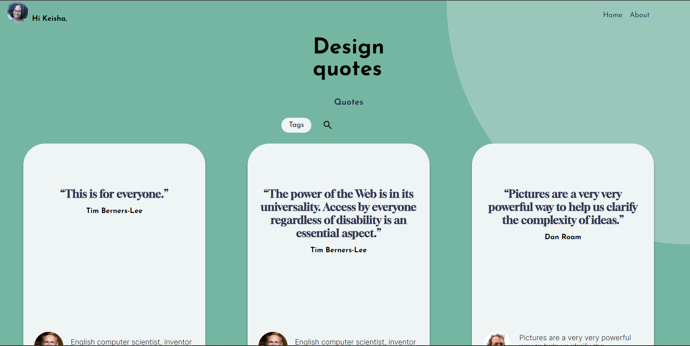
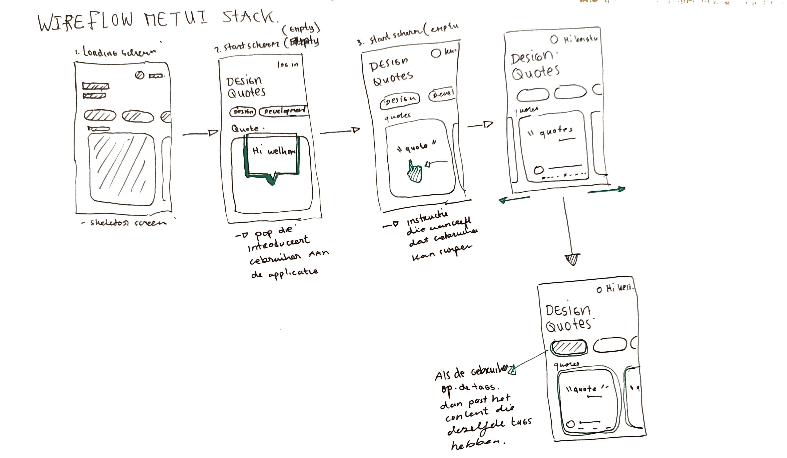
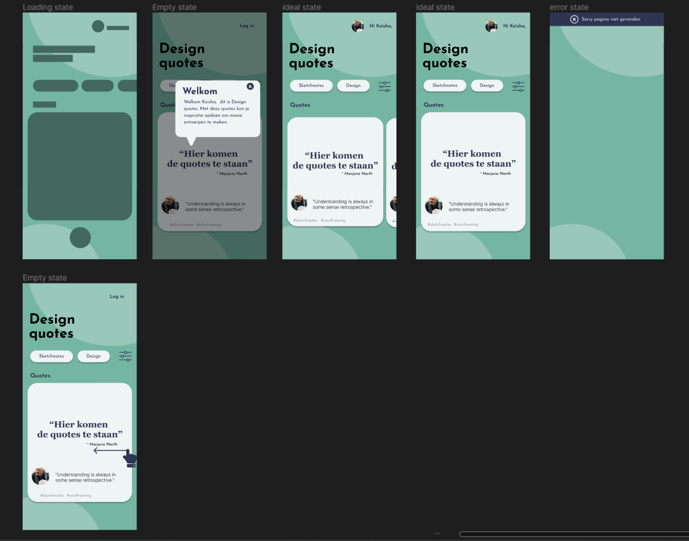
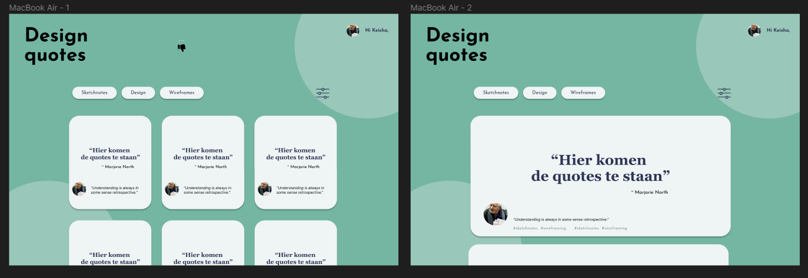
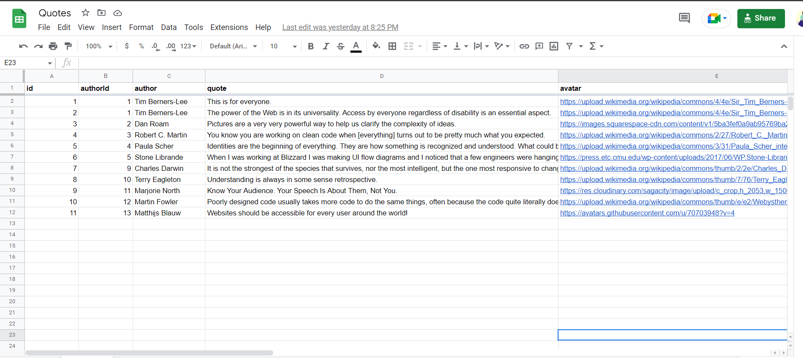
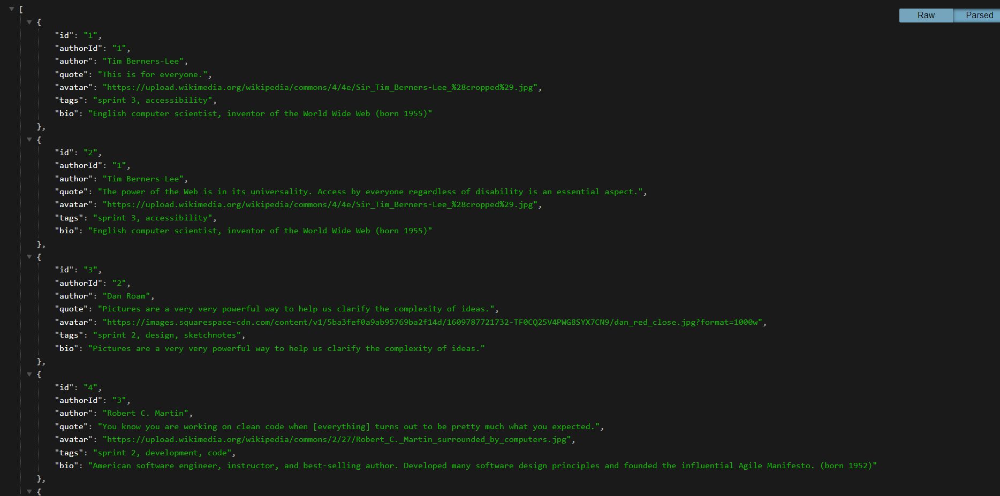
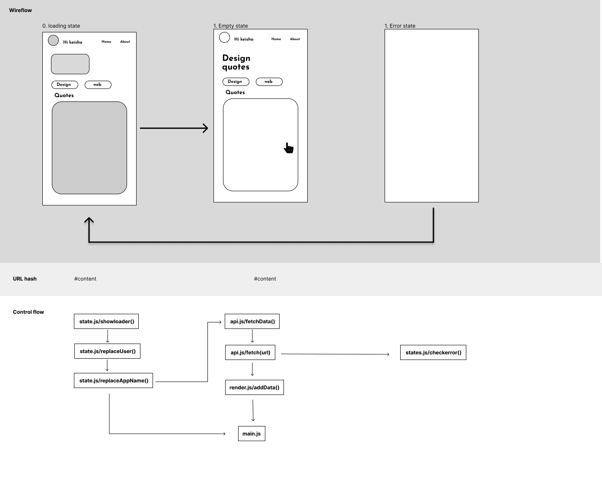

# Design quotes app
 Design quotes is een applicatie voor studenten die opzoek zijn naar inspirerende design citaten om in hun werk te gebruiken. De applicatie heeft een lijst met citaten van verschillende beroemde developers en ontwerpers. Elke citaat bestaat uit de auteur van de citaat, een biografie van de auteur, een foto van de auteur zelf.  De tweede pagina van de applicatie is een about pagina met een korte beschrijving van de applicatie. Tenslotte is de single page applicatie gemaakt met vanilla HTML, CSS en Javascript.  

 

 
 ### Belangrijk webpagina's

- [Visitekaart](https://k3a101.github.io/stress-relief-quotes/visitekaartje/)
- [Design quotes App](https://k3a101.github.io/stress-relief-quotes/spa/)
---
# Inhoudspagina
- [Design quotes app](https://github.com/K3A101/stress-relief-quotes#design-quotes-app)
- [Belangrijke webpaginas](https://github.com/K3A101/stress-relief-quotes#belangrijk-webpaginas)
- [Applicatie installeren](https://github.com/K3A101/stress-relief-quotes#applicatie-installeren)
- [De opdracht](https://github.com/K3A101/stress-relief-quotes#de-opdracht)
- [Idee](https://github.com/K3A101/stress-relief-quotes#idee)
- [Design](https://github.com/K3A101/stress-relief-quotes#design)
- [Features]()
- [API](https://github.com/K3A101/stress-relief-quotes#api)
- [Activity flow](https://github.com/K3A101/stress-relief-quotes#activity-flow)
- [Bronnen](https://github.com/K3A101/stress-relief-quotes#bronnen)
 ---
 # Applicatie installeren
 #### 1. Clone dit repository
 ` git clone https://github.com/K3A101/stress-relief-quotes.git`

#### 2. Verder werken in de spa bestand
Als je verder op het project wil werken, moet je alles in het `spa/` bestand doen. In de spa bestandmap, vind je de alle belangrjke bestanden voor de design quotes app.

---
# De opdracht 
 De opdracht voor dit project is een single page appicatie maken, op basis van een user story. 


## User story
> Als student digital design, wil ik inspirerende web design quotes kunnen bekijken, zodat ik weer een beetje energie krijg wanneer ik het even niet meer zie zitten met al die hard-core deadlines die op me afkomen.


## Idee 
Mijn idee is een quote app voor studenten die opzoek naar inspiratie voor hun projecten. De app heet Design quotes. In design quotes kun je aanmelden en krijg je een lijst met inspirerende quotes van experts in het gebied van design en de web. De quotes worden constant up to date dus elke dag komen meer quotes erbij. Elk citaat bevat een tag die je kan filtreren op basis van design onderwerpen. 



## Design
Hieronder staat het design van de design quotes app. Hier bij had ik ook nagedacht aan de UI stactk die daarbij horen zoals de empty state, loading state en de error state.  



Verder heb ik ook een design bedacht voor groter schermen. Hier verandert alleen de layout. Hier ga je vertical scrollen.




## Features
- [x] Loading state voordat de data geladen wordt.
- [x] Empty state wanneer de data geladen wordt.
- [x] Error state wanneer de data niet geladen wordt.

---
## Wishlist
- [ ] Filtreren op basis van de tags
- [ ] Filtreren op basis van een searchbar
- [ ] Er komt een pop up met instructie wanneer de gebruiker voor het eerst op de applicatie komt.

--- 

# API
## Gemaakt API met google sheet

Voor mijn project heb ik zelf een api gemaakt met behulp van google sheet en de APi van [Ben Borgers](https://github.com/benborgers/opensheet#readme). Om de spreadsheets een json bestand te maken heb ik een aantal stappen doorgenomen. 

### Stappen

- Data invullen in google sheets
    
   
    
- De header is vetgedrukt en die is de objectnaam. Ik heb ook de eerste row gevriesd want anders krijg foutmelding
- Verder heb ik mijn spreadsheats gepubliceerd op de web.    
- De sharing link heb ik iedereen als viewer gegeven. Ik ben de enige met toegang naar het spreadsheet.
- Ik heb de api link van Ben Borgers gebruikt. 
  
   ```
    https://opensheet.elk.sh/spreadsheet_id/tab_name

   ```

- Ik heb  mij spreadsheet code/id and sheet naam aan de link toegevoegd:
```
 https://opensheet.elk.sh/14joQ9h8M0ydoJJ-fNYN68ls3TWPCvk8ZvBJvUXpF1cQ/sheet1
 ```
- De code kun je vinden bij de url van de spreadsheet bestand.

  
Als je deze stappen uitvoert heb je een json bestand met een APi url die je kan fetchen. Een voordeel is dat je data in de spreadsheet  kan toevoegen en wordt de json bestand automatisch aangepast. 

---

# Activity flow


De activity flow is een visualisatie van wat gebeurd in de achtergond . In mijn activity flow heb ik uitegwerkt hoe de loading state totdat de data geladen is.

Onderdelen in de activity flow zijn:
- Wireflow van de states
- Een swimlane van de url hash
- Content  flow
---
# Licentie
Deze project gebruikt de MIT Licentie.

---

### Bronnen
- https://github.com/benborgers/opensheet#readme
- https://benborgers.com/posts/google-sheets-json